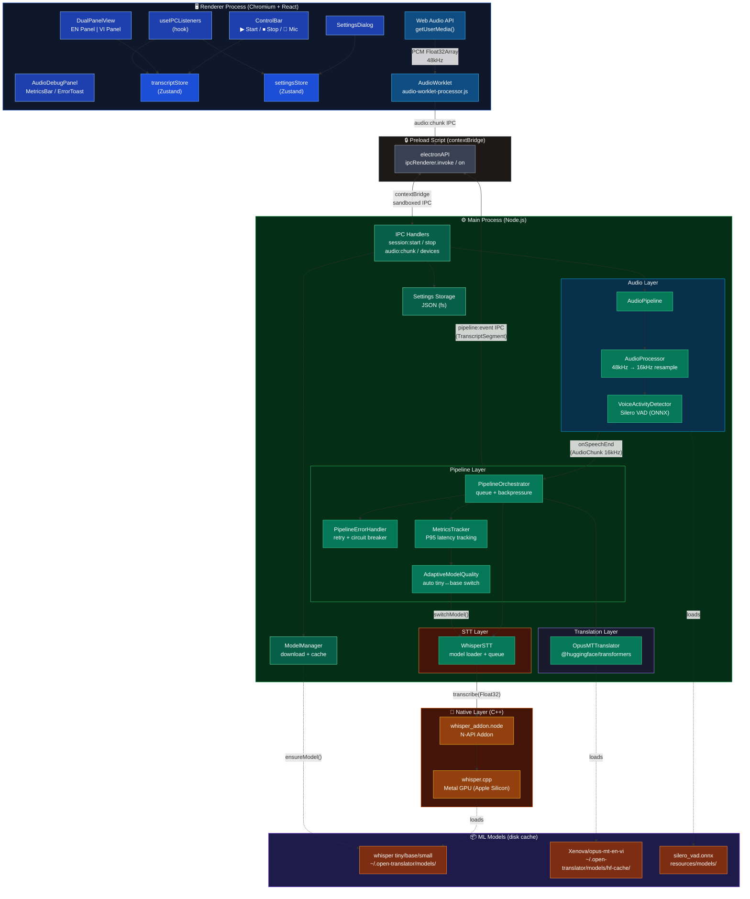
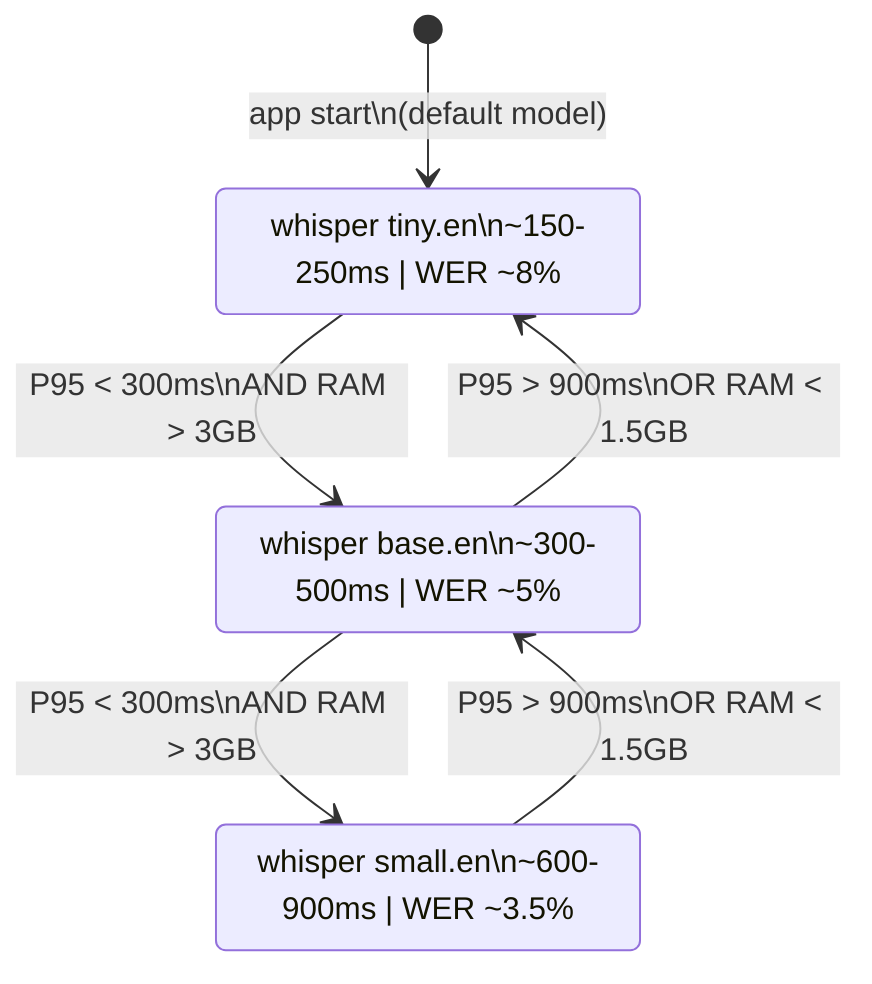

# Open Translator — Architecture

> Real-time English → Vietnamese meeting transcription & translation.
> 100% offline, runs on macOS M1.

---

## 1. Tech Stack

| Layer | Technology | Vai trò |
|---|---|---|
| **Desktop Shell** | Electron v39 | Host cả renderer + main process |
| **Frontend** | React 19 + TypeScript + Tailwind CSS v4 | Component UI, state management |
| **Build Tool** | Vite 7 + electron-vite | Fast HMR, bundling cho Electron |
| **State Management** | Zustand v5 | Minimal store cho transcript + settings |
| **Audio Capture** | Web Audio API (`getUserMedia` + AudioWorklet) | Capture mic, stream PCM frames |
| **VAD** | Silero VAD (ONNX Runtime) | Phát hiện đầu/cuối câu nói |
| **Speech-to-Text** | whisper.cpp (C++ N-API native addon, Metal GPU) | Chuyển audio → English text |
| **Translation** | @huggingface/transformers + ONNX Runtime (Opus-MT) | EN → VI, chạy in-process Node.js |
| **IPC** | Electron `ipcMain` / `ipcRenderer` (contextBridge) | Giao tiếp Renderer ↔ Main |
| **Storage** | File system JSON (settings) | Lưu cài đặt người dùng |
| **Testing** | Vitest | Unit tests cho pipeline/metrics |

---

## 2. System Architecture



---

## 3. Data Flow Pipeline

```mermaid
flowchart LR
    classDef srcNode fill:#0f4c81,stroke:#38bdf8,color:#fff
    classDef procNode fill:#065f46,stroke:#34d399,color:#fff
    classDef mlNode fill:#7c2d12,stroke:#fb923c,color:#fff
    classDef uiNode fill:#1e3a8a,stroke:#93c5fd,color:#fff
    classDef storeNode fill:#4c1d95,stroke:#c4b5fd,color:#fff

    MIC["🎤 Microphone\ngetUserMedia()"]:::srcNode
    WORKLET["AudioWorklet\n48kHz PCM"]:::srcNode
    RESAMPLE["AudioProcessor\n48→16kHz resample"]:::procNode
    VAD["Silero VAD\nspeech detection"]:::mlNode
    ORCH["PipelineOrchestrator\nqueue + backpressure"]:::procNode
    WHISPER["whisper.cpp\nMetal GPU\n~300-500ms"]:::mlNode
    TRANSLATE["Opus-MT\nONNX Runtime\n~80-150ms"]:::mlNode
    IPC["Electron IPC\npipeline:event"]:::procNode
    STORE["transcriptStore\n(Zustand)"]:::storeNode
    UI["DualPanelView\nEN | VI panels"]:::uiNode

    MIC -->|"stream"| WORKLET
    WORKLET -->|"Float32Array\naudio:chunk"| RESAMPLE
    RESAMPLE -->|"16kHz mono"| VAD
    VAD -->|"onSpeechEnd\n(AudioChunk)"| ORCH
    ORCH -->|"transcribe()"| WHISPER
    WHISPER -->|"{ text, timestamps }"| TRANSLATE
    TRANSLATE -->|"{ original, translated }"| IPC
    IPC -->|"TranscriptSegment"| STORE
    STORE -->|"re-render"| UI

    NOTE1["⏱ < 1s window\n(after end-of-speech)"]
    VAD -.->|"start timing"| NOTE1
    UI -.->|"end timing"| NOTE1
```



---

## 4. Concurrent Pipeline

```mermaid
gantt
    title Concurrent Pipeline — Latency per audio chunk
    dateFormat  SSS
    axisFormat %Lms

    section Chunk 1
    VAD detect       :a1, 000, 200ms
    whisper.cpp STT  :a2, after a1, 450ms
    Opus-MT Translate:a3, after a2, 130ms
    IPC + Render     :a4, after a3, 25ms

    section Chunk 2 (pipelined)
    VAD detect       :b1, 500, 200ms
    whisper.cpp STT  :b2, after b1, 450ms
    Opus-MT Translate:b3, after b2, 130ms
    IPC + Render     :b4, after b3, 25ms
```



---

## 5. Electron Process Model

```mermaid
graph LR
    classDef chromium fill:#1e40af,stroke:#93c5fd,color:#fff
    classDef nodejs fill:#065f46,stroke:#6ee7b7,color:#fff
    classDef bridge fill:#374151,stroke:#d1d5db,color:#fff

    subgraph "Renderer Process (Chromium)"
        R["React App\nWeb Audio API\nZustand stores"]:::chromium
    end

    subgraph "Preload Script"
        P["contextBridge\nelectronAPI\n(sandbox boundary)"]:::bridge
    end

    subgraph "Main Process (Node.js)"
        M["IPC Handlers\nAudio Pipeline\nSTT + Translation\nModel Manager\nSettings Storage"]:::nodejs
    end

    R <-->|"ipcRenderer\n(typed events)"| P
    P <-->|"ipcMain\n(handlers)"| M

    style "Renderer Process (Chromium)" fill:#0f172a,stroke:#3b82f6
    style "Preload Script" fill:#1c1917,stroke:#6b7280
    style "Main Process (Node.js)" fill:#052e16,stroke:#16a34a
```

---

## 6. Adaptive Quality System



---

## 7. Latency Budget

```
End-of-speech → text on screen  (target < 1s)

┌──────────────┬────────────┬────────────────────────┐
│ Stage        │ Latency    │ Component              │
├──────────────┼────────────┼────────────────────────┤
│ VAD buffer   │ ~200ms     │ Silero VAD (ONNX)      │
│ whisper.cpp  │ ~300-500ms │ Metal GPU, base model  │
│ Opus-MT      │ ~80-150ms  │ @huggingface/transform │
│ IPC + render │ ~20-30ms   │ Electron IPC + React   │
├──────────────┼────────────┼────────────────────────┤
│ TOTAL        │ ~600-880ms │ ✅ Under 1s            │
└──────────────┴────────────┴────────────────────────┘
```
